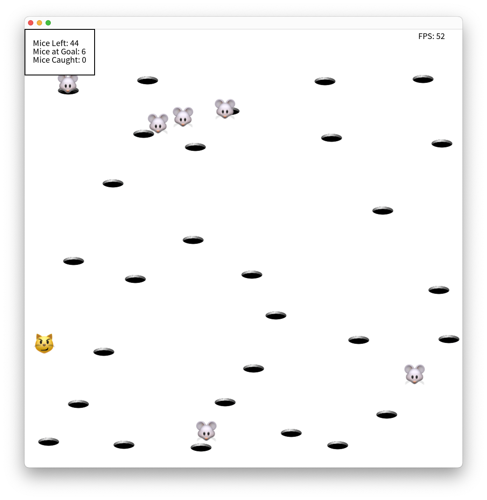

# Cat me if u can (Smalltalk version)

Our solution for the lecture FOOP (Advanced Object Oriented Programming) 2023 
at TU Wien. We also wrote another version [in Eiffel](https://github.com/paulpinter/cat_me_if_u_can) 
and a [multiplayer version in Swift](https://github.com/Jozott00/cat_me_if_u_can/).



## Build it yourself
We used [Pharo](https://pharo.org) to develop the application.

**Note:** The repository must have this name on your disk.

1. Install [Pharo Launcher](https://pharo.org/download)
2. Open the launcher and go to New -> Pharo 11.0 and in Initialization script
add a new one(click on the pen and then plus) and enter:
```smalltalk
[ Metacello new
    baseline: 'Bloc';
    repository: 'github://pharo-graphics/Bloc:dev-1.0/src';
    onConflictUseIncoming;
    ignoreImage;
    load ]
        on: MCMergeOrLoadWarning
        do: [ :warning | warning load ]
```
3. Select the initialization script and click Create Image
4. Select the created image 
5. Go to Browse -> Git Repository Browser -> Add -> Import from existing clone and select this repository
6. In the repository window select "CatMe_SmallTalk" and on all items in that 
repository select Right click -> Load
7. You can now close all windows
8. Go to Browse -> Playground and enter:
```smalltalk
game := CatMeGame new.
game start.
```
9. Finally start the game with the button "Do it"